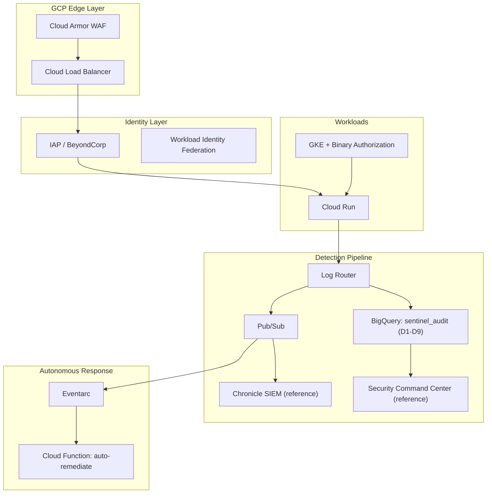

# SENTINEL-X
## GCP Cloud-Native Autonomous Threat Detection & Response Platform

> From audit log to auto-remediation in under 60 seconds.
> A production-grade GCP blue-team platform covering detection engineering,
> Zero Trust identity, and autonomous SOAR.


---

## Architecture



**Five-tier defensive platform** (📐 = reference architecture, requires an Organization —
see [`docs/deployment-status.md`](docs/deployment-status.md)):

| Tier | Name | Key Services |
|------|------|--------------|
| 0 | Perimeter | Cloud Armor, 📐 VPC SC, 📐 Cloud IDS |
| 1 | Identity | Workload Identity, IAP, 📐 IAM Deny |
| 2 | Detection | Log Router, BigQuery, Pub/Sub |
| 3 | Intelligence | 📐 Chronicle SIEM, 📐 SCC, BigQuery |
| 4 | Response | Eventarc, Cloud Functions, Secret Manager |

> **Deployment scope:** the detection, identity, supply-chain, and response layers were
> built and validated hands-on in a single-project sandbox. Controls marked 📐 require a
> GCP Organization resource (unavailable on a consumer Gmail account) and are included as
> designed, documented reference architecture. Full breakdown:
> **[`docs/deployment-status.md`](docs/deployment-status.md)**.

---

## Features

**Deployed and validated hands-on:**

- **9 threat scenarios** simulated and detected (MITRE ATT&CK mapped)
- **9 BigQuery detection queries** (detection-as-code, CI-validated; runnable ad-hoc or as scheduled jobs)
- **Z-score anomaly detection** on API call volumes (O(n) algorithm)
- **Autonomous SOAR**: log sink → Pub/Sub → Cloud Functions auto-remediation in <60s
- **Zero SA keys**: Workload Identity Federation for all CI/CD
- **Binary Authorization**: signed-image admission control (cosign v3 + Cloud KMS attestor)
- **IaC security scanning**: Checkov + Trivy + Semgrep in CI

**Reference architecture** (designed & documented; requires an Organization — see [`docs/deployment-status.md`](docs/deployment-status.md)):

- **3 YARA-L rules** for Chronicle SIEM (portable detection-as-code in `detections/yaral/`)
- **VPC Service Controls** perimeter around BigQuery + GCS
- **Organization Policy + IAM Deny** preventive guardrails
- **Security Command Center** posture aggregation

---

## MITRE ATT&CK Coverage

| Technique | ID | Detection | Automated Response |
|-----------|-----|-----------|-------------------|
| Privilege Escalation via IAM | T1548 | D1, YARAL-1 | Revoke binding |
| Data from Cloud Storage | T1530 | D2 | Revoke public access |
| Valid Accounts (Credential Theft) | T1078 | D3, YARAL-2 | Revoke tokens |
| Resource Hijacking (Crypto) | T1496 | D4, YARAL-3 | Stop instances |
| Create Cloud Account | T1136.003 | D5 | Disable backdoor SA |
| Credentials from Files | T1552.001 | D6 | Revoke access + rotate |
| Exploit Public-Facing App | T1190 | D7 | Delete firewall rule |
| Deploy Container | T1610 | BinAuth block | Blocked at admission |
| Use Alternate Auth Material | T1550.001 | D9 | Revoke impersonation |

---

## Quick Start

### Prerequisites
```bash
gcloud --version          # >= 460.0.0
terraform --version       # >= 1.6.0
python --version          # >= 3.12
```

### Deploy
```bash
git clone https://github.com/<handle>/sentinel-x-gcp
cd sentinel-x-gcp

export PROJECT_ID="your-sandbox-project"
gcloud config set project $PROJECT_ID
gcloud auth application-default login

gcloud services enable logging.googleapis.com bigquery.googleapis.com \
  securitycenter.googleapis.com iam.googleapis.com pubsub.googleapis.com \
  cloudfunctions.googleapis.com cloudasset.googleapis.com

cd terraform/
terraform init
terraform plan  -var="project_id=$PROJECT_ID" -var="alert_email=you@example.com"
terraform apply -var="project_id=$PROJECT_ID" -var="alert_email=you@example.com"
```

### Run Attack Simulations
```bash
# SAFETY: Only run in your throwaway sandbox project!
bash attack-simulations/SIM-001_privilege_escalation.sh $PROJECT_ID
bash attack-simulations/SIM-002_public_bucket.sh $PROJECT_ID
```

---

## Repository Layout

```
terraform/        Infrastructure as Code (VPC, IAM, logging, monitoring, security)
detections/       BigQuery SQL, YARA-L, Sigma detection rules
scripts/          Python automation (IR, forensics, anomaly detection)
playbooks/        Incident response runbooks (6)
tests/            Detection rule fixtures + pytest
tools/            CI validators for detection rules
attack-simulations/  Safe attack simulators for the sandbox
.github/workflows/   CI/CD security pipelines
docs/             Threat model, data flow, compliance, cost
```

See `docs/` for the full design documentation.

---

## Lessons Learned

Operational lessons from building this hands-on (the failures taught more than the successes):

1. **IAM is the primary attack surface in GCP** — instrument `SetIamPolicy` above all else, and parse `bindingDeltas` with `UNNEST` (typed `action = "ADD"`) rather than string-matching the serialized proto, or revocations become false positives.
2. **Least privilege surfaces hidden dependencies.** Removing the default `roles/editor` from the Compute Engine and App Engine default SAs broke Cloud Build *and* the Eventarc invoker for the remediation function. The right fix was granting back *scoped* roles (`cloudbuild.builds.builder`, `run.invoker`) — never reverting to editor.
3. **Debug identity from the source, not assumption.** A Gen2 function's Pub/Sub trigger authenticated as its *runtime* SA, not the compute default I expected — reading `pubsub subscriptions list` (the OIDC token SA) settled it in one command.
4. **Statistics have small-sample limits.** A population z-score maxes out at √(n−1); with 4 principals, 3σ is mathematically unreachable — you tune the threshold to the population, and say so rather than faking a flag.
5. **Sign the digest, not the tag.** A signature bound to a mutable tag can be defeated by re-pushing that tag; bind attestations to the immutable `@sha256:` digest.
6. **A whole class of preventive controls is Organization-gated.** SCC, Org Policy, IAM Deny, and VPC-SC all fail identically on a consumer account with no Org — knowing that boundary up front changes how you scope a build.
7. **Workload Identity Federation eliminates the #1 credential-theft vector** — no long-lived SA keys anywhere in CI/CD.

---
Built by Ravindrababu Behara | GCP-First | Defensive Security Engineer Track | 2026
